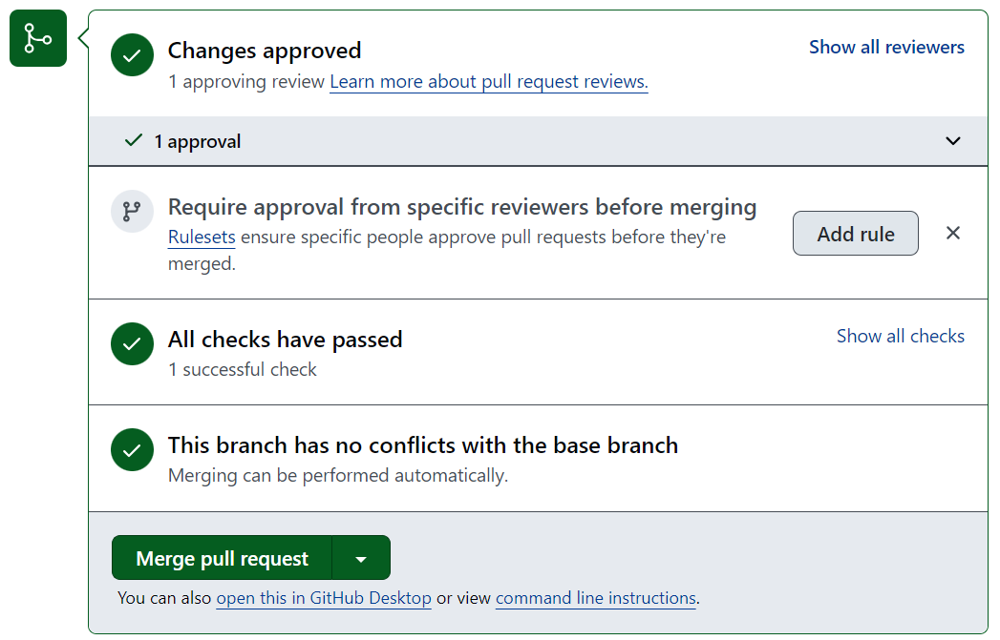

# Pull requests - ハンズオン

## 目次

- コード変更
- Pull request作成
- レビュー・修正依頼
- 再リクエスト
- 再レビュー・Approve・マージ

## 手順

### コード変更

まずは新規ファイルを追加しましょう。  
[playground](./../playground)ディレクトリを開いて、画面右上の「Add file」ボタンを押下、「Create new file」を選択します。


ファイル名を `<ユーザーid>.md` とし、任意のファイル内容を入力します。


画面右上の「Commit changes...」ボタンを押下し、ポップアップを表示します。  
「Create a **new branch** for this commit and start a pull request」のラジオボタンを選択します。  
このとき、ブランチ名が `<ユーザーid>-patch-1` のように自身のユーザーidを含むものとなっていることを確認したうえ、「Propose changes」ボタンを押下します。


### Pull request作成

Pull request作成画面を開きます。（「コード変更」節の流れでPull request画面が表示された場合はそのままで構いません。）  
Reviewers欄でレビュー依頼を行う方を選択したうえで、「Create pull request」ボタンを押下します。


### レビュー・修正依頼

他のメンバーのソースコード差分を確認して、修正依頼の操作を行ってみましょう。  
Pull requestsタブを開きます。  
Filters入力欄に下記を入力し、自身がReviewersに設定されているPull requestを確認します。

```
user-review-requested:@me
```

自身がReviewersに設定されているPull requestを選択して、Pull request詳細画面を開きます。

Pull request詳細画面中の「Files changed」タブを開きます。  
任意の行にマウスカーソルを合わせ、「+」ボタンを押下しコメントを記入します。  
「Start a review」ボタンを押下します。


Files changedタブ内右上の「Review changes」ボタンを押下し、「Request changes」ラジオボタンを選択したうえ「Submit review」ボタンを押下します。


Request changesステータスに変更されたことを確認します。


### 再リクエスト

自身で作成したPull requestを開き、Reviewers欄から再度レビュー依頼を行います。  
（本来であれば、コメントされた依頼内容を反映した後に行う操作となりますが、今回はこのまま再依頼のみ行います。）


### 再レビュー・Approve・マージ

再レビュー依頼されたPull requestに対して、Approveとマージを行いましょう。  
レビュー対象のPull requestを開きます。  
先程記入したコメントに対して、「Resolve conversation」ボタンを押下してコメントをクローズします。  
次に、Files changedタブ内右上の「Review changes」ボタンから、今度は「Approve」ラジオボタンを選択したうえ「Submit review」を押下します。


Pull request詳細画面内の「Conversation」タブに戻り、「Merge pull request」ボタンを押下してマージします。  



その後、「Delete branch」ボタンを押下してブランチを削除しておきましょう。


以上で、Pull requestの章は完了となります。

## 参考ドキュメント

- [Pull request のドキュメント - GitHub Docs](https://docs.github.com/ja/pull-requests)
- [pull request の作成 - GitHub Docs](https://docs.github.com/ja/pull-requests/collaborating-with-pull-requests/proposing-changes-to-your-work-with-pull-requests/creating-a-pull-request)
- [プルリクエストのレビューについて - GitHub Docs](https://docs.github.com/ja/pull-requests/collaborating-with-pull-requests/reviewing-changes-in-pull-requests/about-pull-request-reviews)
