# Issues & Projects - ハンズオン

## 目次

- Milestone作成
- Issue作成
- Projects
- グラフ表示
- 【紹介】Projectのカスタムフィールドについて
- 【紹介】Issueテンプレートについて

## 手順

### Milestone作成

まず始めにMilestoneを作成します。  
Issuesタブを開き、画面右上の「Milestones」を押下します。  
その後、画面右上の「New milestone」ボタンを押下します。  
Titleは自身が作成したとわかるもの（例: `<ユーザーid>-v1` ）としましょう。  
Due dataに任意の日付を入力したうえ、「Create milestone」を押下します。

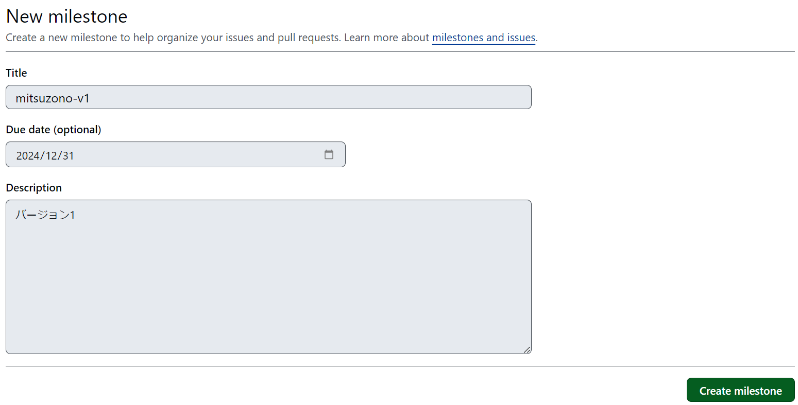

### Issue作成

次に、Issueの作成～クローズまでを行います。  
再度Issuesタブを開き、画面右上の「New issue」ボタンを押下します。  
下記情報を入力・設定したうえ、「Submit new issue」ボタンを押下します。

- Title: 任意の文言
- Description: 任意の文言
- Assignees: 自身のアカウント
- Labels: `docummentation`
- Milestone: 先程作成したMilestone

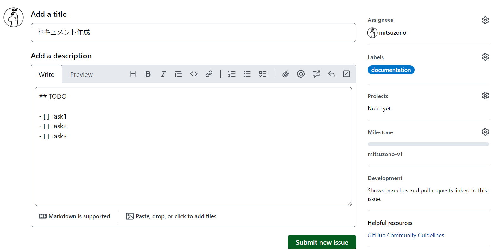

作成完了後、Issue詳細画面内右メニュー中の「Development」欄から、先ほどのハンズオンで作成・クローズしたPull requestを選択します。

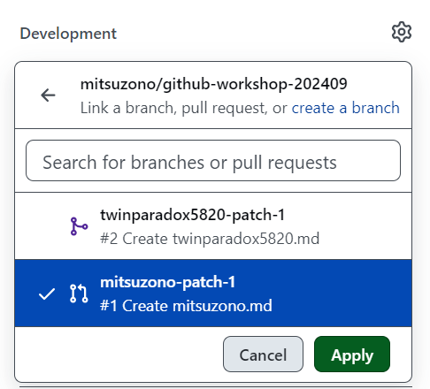

任意のコメントを入力し、「Comment」ボタンを押下してコメントが追加されることを確認します。  
「Close issue」ボタン（またはコメント入力して「Close with comment」）を押下して、ステータスがクローズに変更されることを確認します。

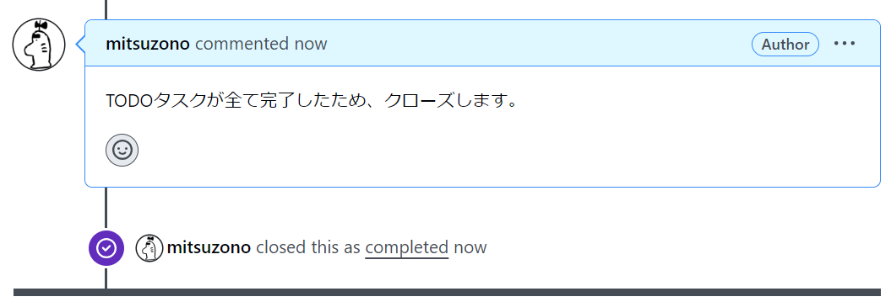

### Projects

次に、Projectの作成やアイテムの追加、各ビューの
Projectsタブを開き、「New project」ボタンを押下して新規Projectを作成します。  
テンプレートを選択するポップアップが表示されるので、「Team planning」を選択します。

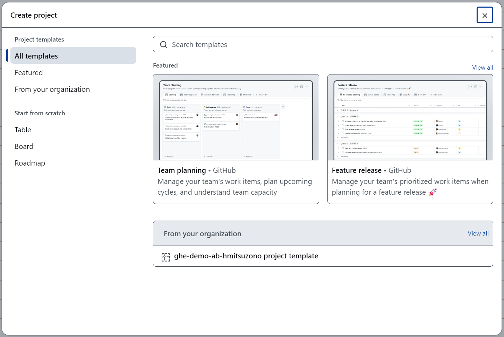

Project画面下部の「Add item」を押下し、アイテムを追加します。  
追加したアイテムを開き、下記情報を入力・設定します。

- Assignees: 自身のアカウント
- Iteration: `Iteration` (Current表示のあるもの)
- 上記以外の項目: 任意の値

その後、「Convert to issue」を選択し、このリポジトリのIssueとして登録します。

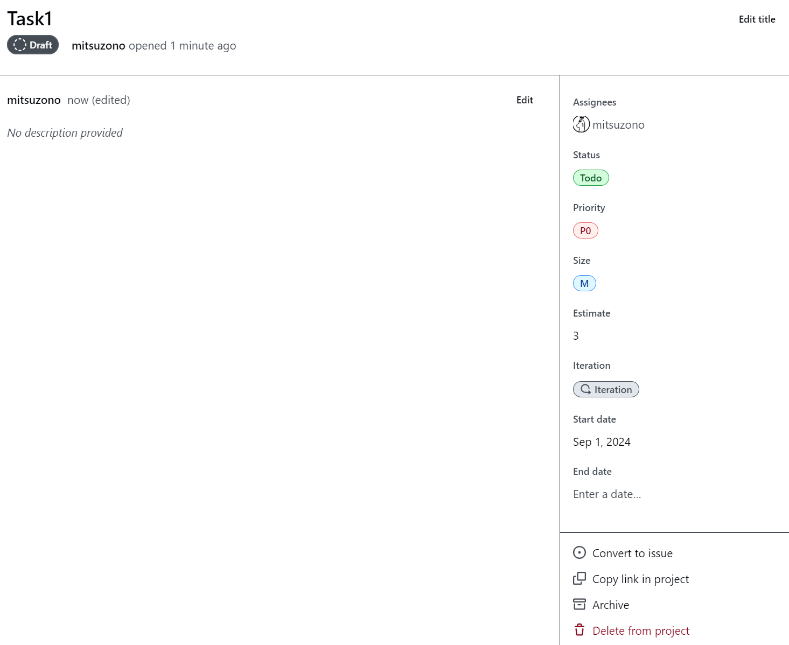

同様にもう2つほどアイテムを作成します（Assigneesは自身、Iterationは「Iteration(Current表示のあるもの)」としてください）。  
一つのアイテムのステータスをIn Progressに、もう一つのアイテムのステータスをDoneに変更します。  
Projectの画面で他のタブ「Team capacity」や「Current iteration」の表示を確認します。

Backlog:

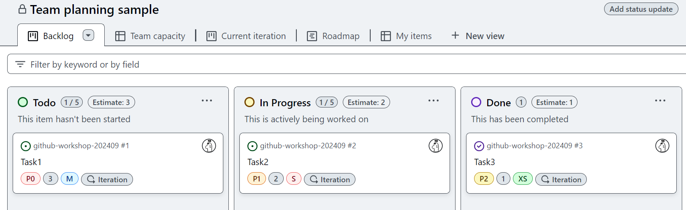

Team capacity:  
（このテンプレートにおけるカスタムフィールド `Estimate` は見積もり工数を表しており、 `Priority(P0/P1/P2)` でグルーピングした際のEstimateの合計値が表示されていることも確認できます。）

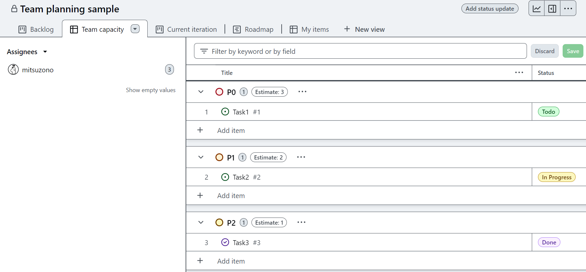

Current iteration:

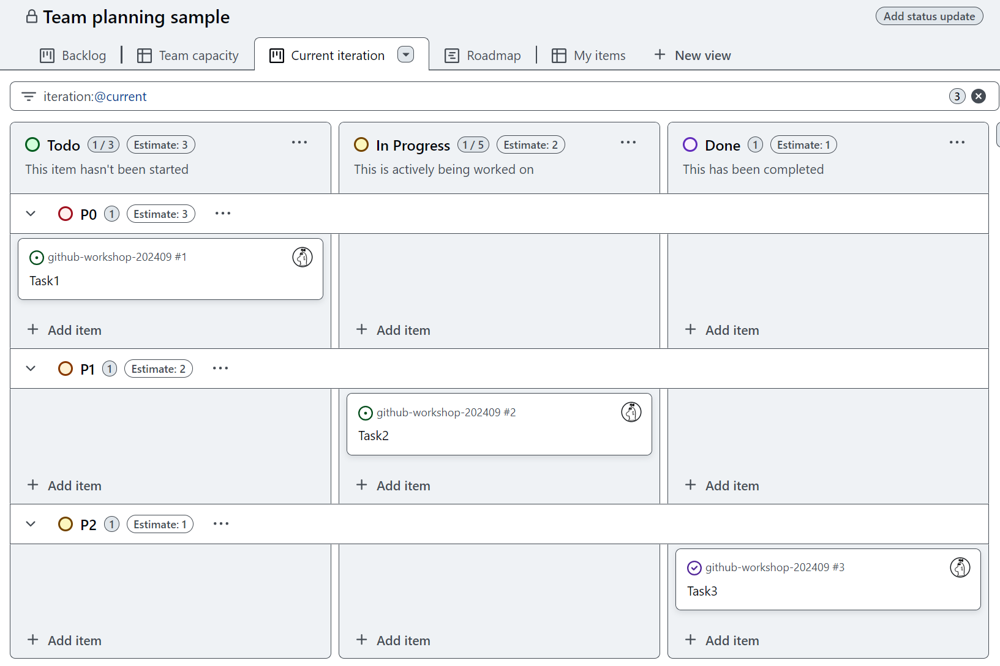

### グラフ表示

Project画面内右上のグラフのアイコンを押下します。  
デフォルトでバーンアップチャートやステータスチャートを見ることができますが、Custom chartsを追加することも可能です。  
「New chart」ボタンを押下後、グラフ画面右上の「Configure」ボタンを押下し、下記設定を行ってユーザー別担当アイテム数状況のグラフを表示しましょう。

- Layout: `Stacked column`
- X-axis: `Assignees`
- Group by (optional): `Status`
- Y-axis: `Count of items`

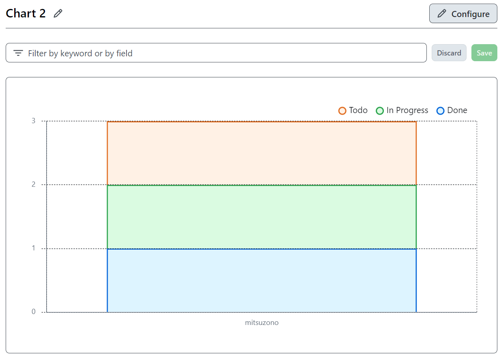

Assignees割り当ての無いアイテムを追加した際の表示例:

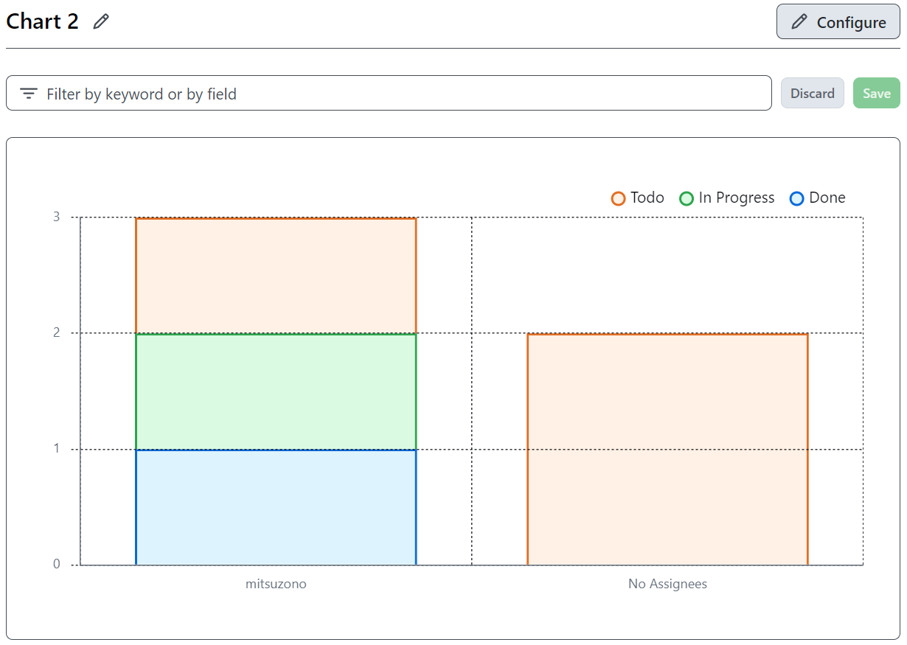

### 【紹介】Projectのカスタムフィールドについて

Project画面右上の「…」メニューより「Settings」を開くことで、ProjectのREADMEの設定やカスタムフィールドの管理を行うことができます。  
今回は「Team planning」テンプレートを使用したので、予め複数のカスタムフィールドが定義されています。  
（Priority、Estimate、Iterationなどは全てカスタムフィールド定義です。「Team planning」テンプレートを使用しない場合は自身で追加する必要があります。）  
他のプロジェクトでの使用を検討される場合は、こちらの定義内容をご参考ください。

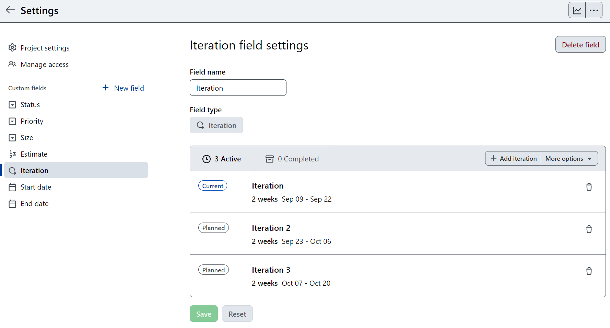

### 【紹介】Issueテンプレートについて

Issueテンプレートを使用することで、課題やバグ報告の起票時のフォーマットを定めることができます。  
Issueテンプレートは、リポジトリのSettingsタブから管理・追加が可能です。

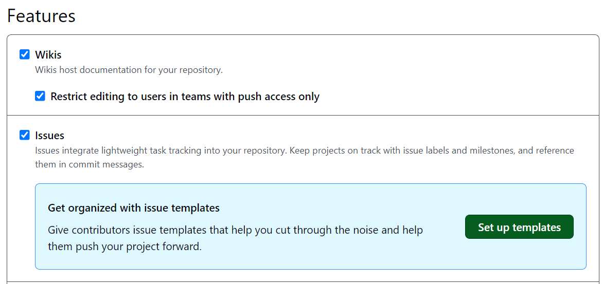

テンプレート作成画面ではDescriptionやTitle、Assignees、Labelsに対するデフォルト値が設定できます。

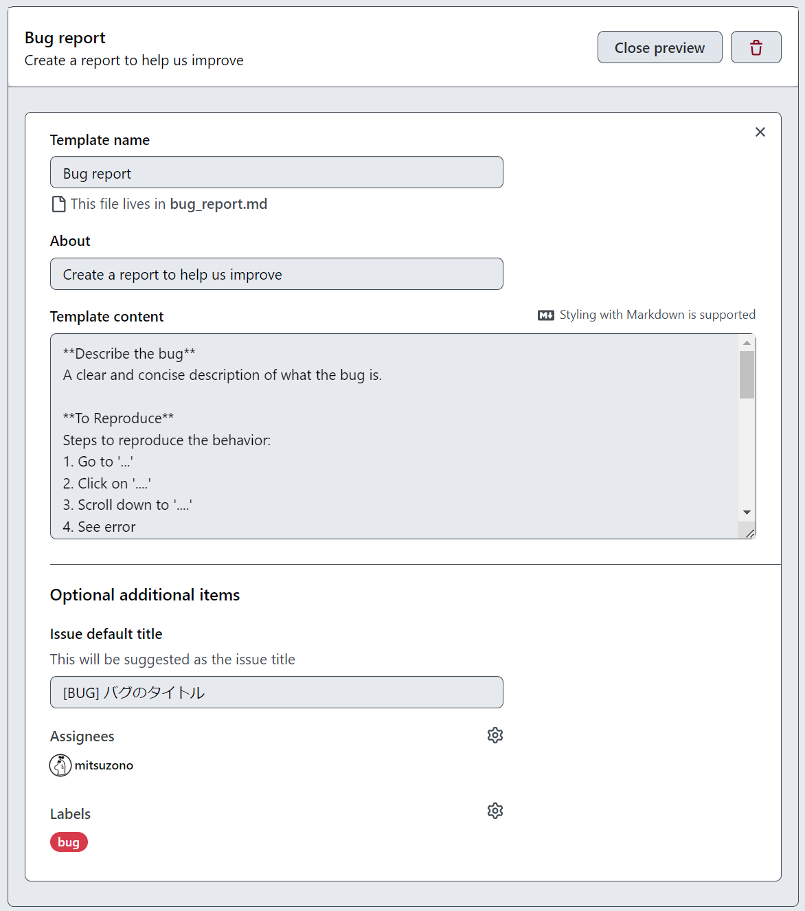

また、Issueテンプレート自体はリポジトリ内で `.github/ISSUE_TEMPLATE/*.md` ファイルとして管理されているため、会社で共通のテンプレートファイルを定めて配置しておくことも可能です。

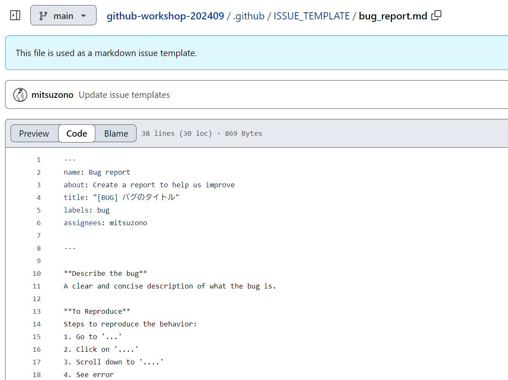

テンプレート追加後、Issuesタブの「New issue」ボタンからIssue作成画面へ遷移する際、テンプレート選択画面が表示されるようになります。  
（この時、もしテンプレートを使用せずにIssue作成したい場合は、「Open a blank issue」リンクを選択します。）

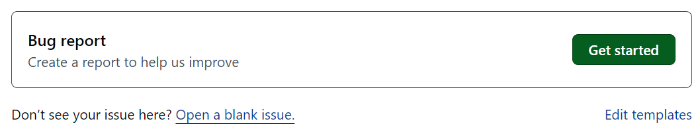

以上で、Issues & Projectsの章は完了となります。

## 参考ドキュメント

- [GitHub Issues のドキュメント - GitHub Docs](https://docs.github.com/ja/issues)
- [Issue の作成 - GitHub Docs](https://docs.github.com/ja/issues/tracking-your-work-with-issues/creating-an-issue)
- [Projects のクイック スタート - GitHub Docs](https://docs.github.com/ja/issues/planning-and-tracking-with-projects/learning-about-projects/quickstart-for-projects)
- [Projects のベスト プラクティス - GitHub Docs](https://docs.github.com/ja/issues/planning-and-tracking-with-projects/learning-about-projects/best-practices-for-projects)
